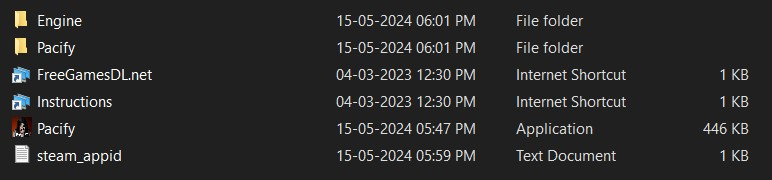
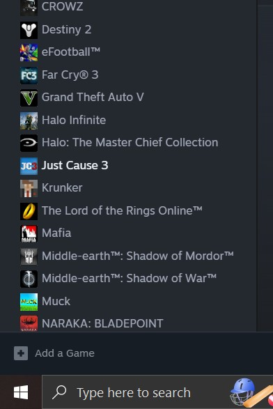

# 📜 Pacify Installation Guide

Follow these simple steps to download and install **Pacify** on your system! 🎮

---

## 🚀 Steps to Download and Install

### 1️⃣ Download **Pacify**
👉 Click the link below to download the game: **[Download Pacify](https://drive.google.com/file/d/1c-1sksdAfPPQlWYI3JxEOdHzizhwNC27/view?usp=sharing)**

---

### 2️⃣ Extract the Game Files
- Navigate to the folder where the game was downloaded.
- Right-click the downloaded file and select **Extract Here** (or use your preferred extraction tool).
- Ensure all files are extracted properly.

- this is how the files should look:
  

---

### 3️⃣ Download and Install **Steam**
👉 Download Steam from the official link below: **[Download Steam](https://cdn.fastly.steamstatic.com/client/installer/SteamSetup.exe)**

- Run the **SteamSetup.exe** file and follow the on-screen instructions to complete the installation.
- Launch **Steam** and log in (or create a new account if needed).

---

### 4️⃣ Add **Pacify** to Steam
1. Open **Steam** and click on **Add a Game** located in the bottom-left corner.
  

2. Select **Add a Non-Steam Game...** from the menu.  
  
---

### 5️⃣ Locate **Pacify.exe**
- Browse to the folder where the **Pacify.exe** file is located.  
- Select **Pacify.exe** and click **Add Selected Programs** to add it to Steam.

---

### 6️⃣ Launch the Game
- Navigate to the **Library** tab located on the top navbar in Steam.  
- Find **Pacify** in the list of games, select it, and click **PLAY**. 🎉

---

## 🎮 You're All Set!
Enjoy playing **Pacify**! If you encounter any issues, feel free to reach out for help.

---

### 💡 Tips:
- Make sure your system meets the game's requirements.
- Keep **Steam** updated to avoid compatibility issues.
